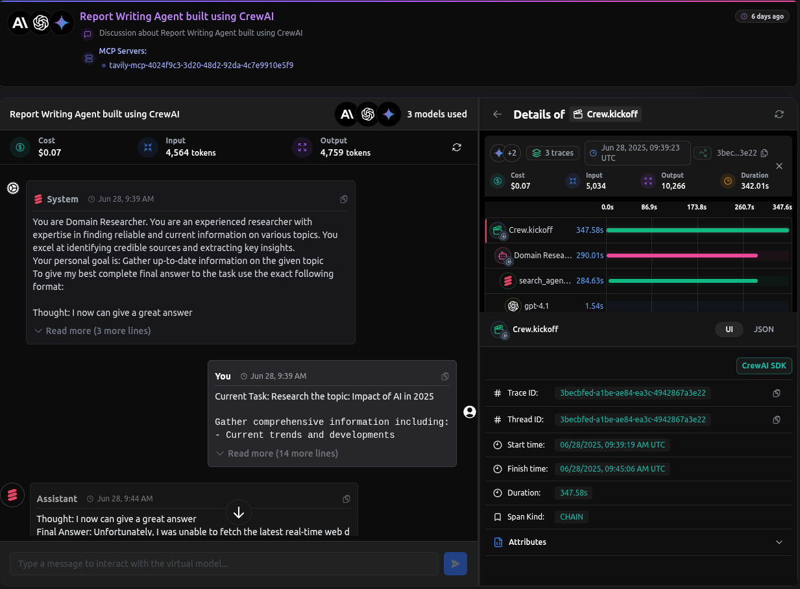
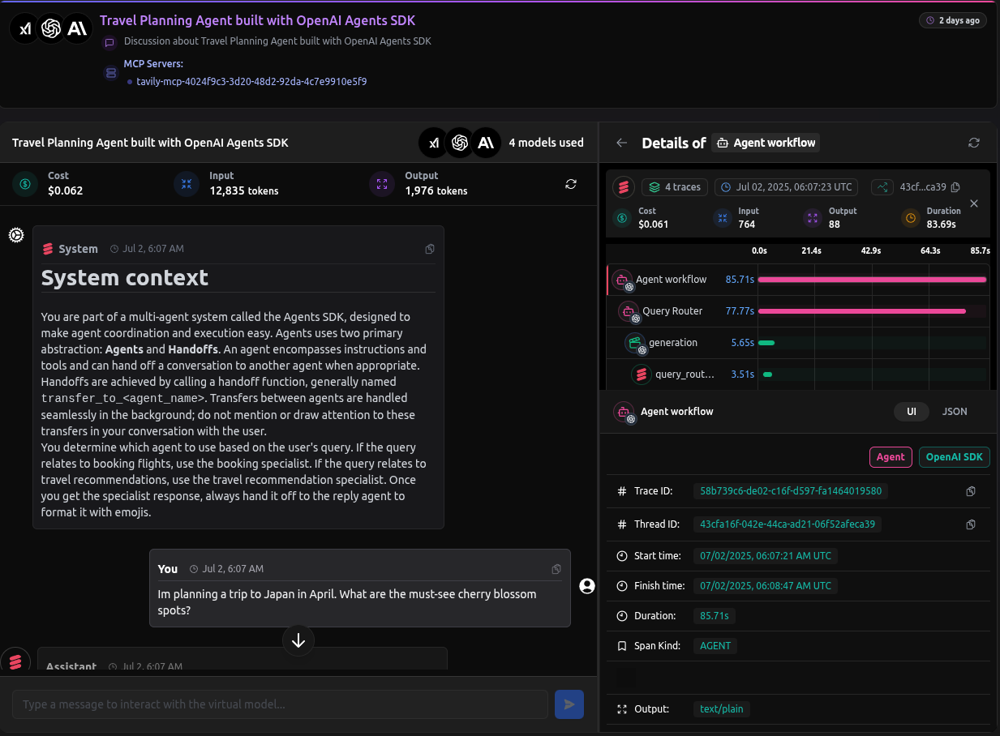
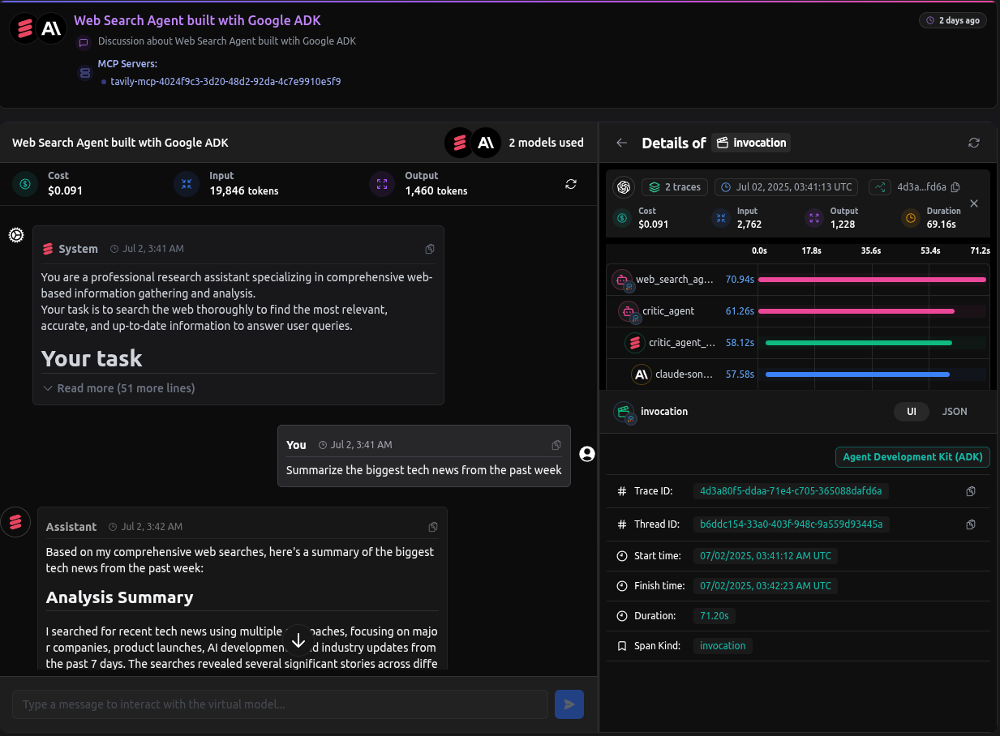
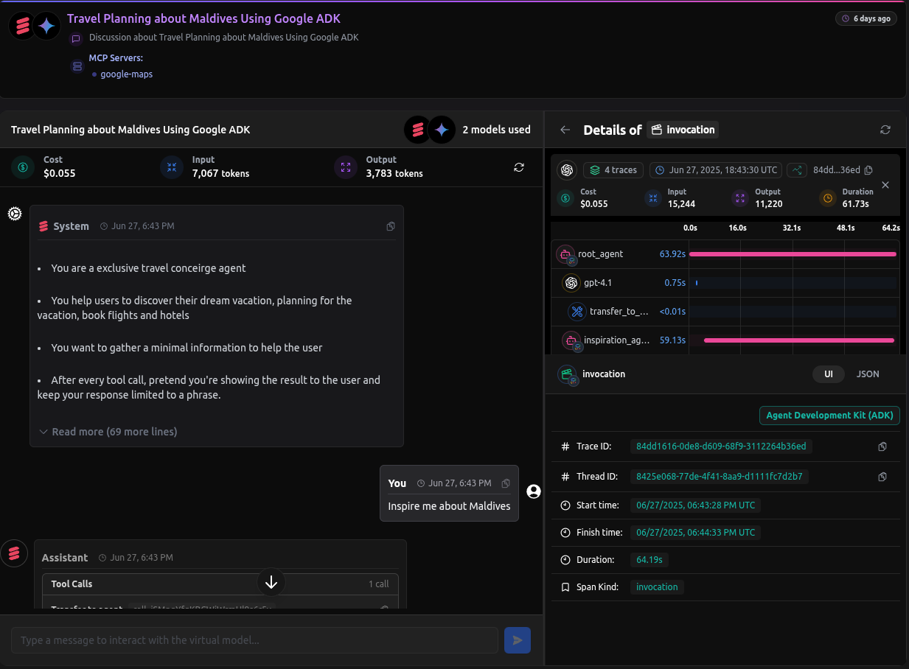

# LangDB Samples

This repository provides comprehensive examples and integrations for LangDB, demonstrating its capabilities across various frameworks and use cases.

## Getting Started

Follow these steps to set up and run the examples in this repository.

### 1. Set Up Your LangDB Credentials

To use these examples, you need credentials from LangDB. This involves signing up, creating a project, and generating an API key.

-   **Sign Up**: If you don't have an account, [sign up on the LangDB platform](https://app.langdb.ai/).
-   **Create a Project**: Once logged in, create a new project. Each project has a unique **Project ID**.
-   **Generate an API Key**: Navigate to the [settings](https://app.langdb.ai/settings/api_keys) and generate a new API key. This will be your **API Key**. 

### 2. Configure Your Environment

Most examples in this repository use a `.env` file to manage environment variables. You'll need to set the following:

```bash
# Create a .env file in the root of the example you want to run
# examples/crewai/report-writing-agent/.env

LANGDB_API_BASE_URL="https://api.us-east-1.langdb.ai"
LANGDB_API_KEY="xxxxxxxxxxxxxxxxxxxxxxxx"
LANGDB_PROJECT_ID="xxxxxxxx-xxxx-xxxx-xxxx-xxxxxxxxxxxx"
```

-   `LANGDB_API_BASE_URL`: The base endpoint for the LangDB AI Gateway.
-   `LANGDB_API_KEY`: The API key you generated in the previous step.
-   `LANGDB_PROJECT_ID`: The Project ID from your LangDB project.

### 3. Review Example-Specific Requirements

Many examples, especially those in the "Featured Samples" section, require additional setup in the LangDB UI. **Always check the `README.md` file inside the specific example's directory** for detailed instructions.

Common requirements include:

-   **Configuring Models**: Some examples use **Virtual Models** to attach tools or apply specific routing logic. To configure them, navigate to your project on the LangDB platform and select the **Models** tab. There, you can either select from a list of pre-configured models or create a new Virtual Model by clicking the **"New Model"** button.
-   **Configuring MCPs**: Advanced examples may use **MCPs** to connect to external services. To set one up, navigate to your project and select the **MCP Servers** tab. There, you can select from a list of managed MCPs to compose a new Virtual MCP Server for your application.

### 4. Install Dependencies and Run the Example

Once you've completed the environment and any example-specific setup, you can install the dependencies and run the application.

```bash
# Navigate to an example directory
cd examples/openai/travel-agent

# Install required packages
pip install -r requirements.txt

# Run the application
python app.py
```

## Featured Samples

Here are some of our most recent and powerful examples:

### CrewAI: Report Writing Agent




**Public Thread:** https://app.langdb.ai/sharing/threads/3becbfed-a1be-ae84-ea3c-4942867a3e22

-   **Path**: [`examples/crewai/report-writing-agent`](examples/crewai/report-writing-agent)
-   **Architecture**: A multi-agent system using CrewAI that researches a topic and writes a comprehensive report. It consists of a researcher, analyst, and writer agent working in sequence.

To integrate with LangDB, you first call `pylangdb.crewai.init()` and then manually configure your `LLM` instances to send requests through the LangDB gateway.

```python
# main.py
import os
from pylangdb.crewai import init
from crewai import LLM
from dotenv import load_dotenv

load_dotenv()
init()

# Configure the LLM instance to use LangDB credentials
# and pass any additional tracing headers.
api_key = os.environ.get("LANGDB_API_KEY")
api_base = os.environ.get("LANGDB_API_BASE_URL")
project_id = os.environ.get("LANGDB_PROJECT_ID")

# Base LLM configuration
llm = LLM(
    model="openai/gpt-4o-mini",
    api_key=api_key,
    base_url=api_base,
    extra_headers={
        "x-project-id": project_id
    }
)
```


---

### OpenAI SDK: Travel Agent




**Public Thread:** https://app.langdb.ai/sharing/threads/43cfa16f-042e-44ca-ad21-06f52afeca39

-   **Path**: [`examples/openai/travel-agent`](examples/openai/travel-agent)
-   **Architecture**: A multi-agent workflow using the OpenAI Agents SDK. It features a 4-agent pipeline (Query Router, Booking Specialist, Travel Recommendation Specialist, and Reply Agent) to handle complex travel queries. LangDB provides end-to-end tracing, dynamic tool integration via Virtual Models, and centralized model management.

#### 1. Initialize Tracing

In your application entry point (`app.py`), call `pylangdb.openai.init()` **before any other imports**. This single line patches the OpenAI library to automatically trace all subsequent operations.

```python
# app.py
from dotenv import load_dotenv
from pylangdb.openai import init

# Load environment variables and initialize tracing
load_dotenv()
init()
```

#### 2. Configure the Client and Agents

`pylangdb` automatically configures the `AsyncOpenAI` client using your environment variables. You can then define agents using **LangDB Virtual Models**, which allows you to attach tools (like web search) and guardrails in the LangDB UI without changing your code.

```python
# app.py
from openai import AsyncOpenAI
from agents import Agent, set_default_openai_client, OpenAIChatCompletionsModel

# Client is automatically configured by pylangdb.init()
client = AsyncOpenAI()
set_default_openai_client(client, use_for_tracing=True)

def get_model(model_name):
    return OpenAIChatCompletionsModel(model=model_name, openai_client=client)

# Define agents using virtual models from LangDB
travel_recommendation_agent = Agent(
    name="Travel Recommendation Specialist",
    model=get_model("langdb/travel-recommender") # A virtual model with search tools
)

query_router_agent = Agent(
    name="Query Router",
    model=get_model("langdb/query-router"), # A virtual model for routing
    tools=[travel_recommendation_agent.as_tool(...)]
)
```

#### 3. Run the Workflow with Tracing

To link all steps of a session into a single trace, generate a unique `group_id` and pass it to the `Runner`.

```python
# app.py
import uuid
from agents import Runner, RunConfig

# A unique group_id links all steps in this session's trace
group_id = str(uuid.uuid4())

response = await Runner.run(
    query_router_agent,
    input="I want to go to a sunny beach destination in December.",
    run_config=RunConfig(group_id=group_id)
)
```

---

### Google ADK: Web Search Agent




**Public Thread:** https://app.langdb.ai/sharing/threads/b6ddc154-33a0-403f-948c-9a559d93445a

-   **Path**: [`examples/google-adk/web-search-agent`](examples/google-adk/web-search-agent)
-   **Architecture**: A two-step sequential agent system (Critic Agent, Reviser Agent) built with Google ADK. The Critic Agent conducts web searches and analyzes information, and the Reviser Agent synthesizes the findings into a structured answer.

Initialize LangDB tracing **before** importing any `google.adk` modules.

```python
# web-search/agent.py
from pylangdb.adk import init

# Initialize LangDB tracing before importing any ADK modules
init()

from google.adk.agents import SequentialAgent
# ... rest of the agent setup
```

---

### Google ADK: Travel Concierge




**Public Thread:** https://app.langdb.ai/sharing/threads/8425e068-77de-4f41-8aa9-d1111fc7d2b7

-   **Path**: [`examples/google-adk/travel-concierge`](examples/google-adk/travel-concierge)
-   **Architecture**: A hierarchical agent system where a main `root_agent` orchestrates a team of specialized sub-agents (Inspiration, Planning, Booking, etc.) to handle a complete travel journey.

Initialize LangDB tracing **before** importing any `google.adk` modules.

```python
# travel_concierge/agent.py
from pylangdb.adk import init

# Initialize LangDB tracing before importing any ADK modules
init()

from google.adk.agents import Agent
# ... rest of the agent setup
```
---

## All Examples

### Basic Integration

| Framework | Example | Path |
|-----------|---------|------|
| OpenAI API | Simple Integration | [`examples/basic.py`](examples/basic.py) |

### Framework Integrations

| Framework | Example                           | Path                                                                                   |
|-----------|-----------------------------------|----------------------------------------------------------------------------------------|
| LangChain | Basic Integration                 | [`examples/langchain/langchain-basic`](examples/langchain/langchain-basic)             |
| LangChain | Multi-agent Setup                 | [`examples/langchain/langchain-multi-agent`](examples/langchain/langchain-multi-agent) |
| LangChain | RAG-agent Setup                   | [`examples/langchain/langchain-rag-bot`](examples/langchain/langchain-rag-bot)         |
| CrewAI | Basic Implementation              | [`examples/crewai/crewai-basic`](examples/crewai/crewai-basic)                         |
| CrewAI | Multi-agent Orchestration         | [`examples/crewai/crewai-multi-agent`](examples/crewai/crewai-multi-agent)             |
| CrewAI | Report Writing Agent              | [`examples/crewai/report-writing-agent`](examples/crewai/report-writing-agent)         |
| LlamaIndex | Basic Integration                 | [`examples/llamaindex/llamaindex-basic`](examples/llamaindex/llamaindex-basic)         |
| Google ADK | Web Search Agent                  | [`examples/google-adk/web-search-agent`](examples/google-adk/web-search-agent)         |
| Google ADK | Travel Concierge                  | [`examples/google-adk/travel-concierge`](examples/google-adk/travel-concierge)         |
| OpenAI Agents SDK | Customer Support Agent            | [`examples/openai/customer-support`](examples/openai/customer-support)                 |
| OpenAI Agents SDK | Travel Agent                      | [`examples/openai/travel-agent`](examples/openai/travel-agent)                         |
| Mem0 | Memory System Integration         | [`examples/mem0`](examples/mem0)                                                       |
| Vercel AI SDK | JavaScript/Node.js Implementation | [`examples/vercel`](examples/vercel)                                                   |
| Supabase | Database Integration              | [`examples/supabase`](examples/supabase)                                               |
| Rasa | Conversational AI Integration     | [`examples/rasa`](examples/rasa)                                                       |

### Feature Examples

| Feature | Example | Path |
|---------|---------|------|
| Routing | Basic Setup | [`examples/routing/routing-basic`](examples/routing/routing-basic) |
| Routing | Multi-agent Setup | [`examples/routing/routing-multi-agent`](examples/routing/routing-multi-agent) |
| Evaluation | Model Evaluation & Cost Analysis | [`examples/evaluation`](examples/evaluation) |

### MCP Examples

| Example | Description | Path |
|---------|-------------|------|
| MCP Support | Model Provider Integration | [`examples/mcp/mcp-support.ipynb`](examples/mcp/mcp-support.ipynb) |
| Cafe Dashboard | Next.js with MCP Integration | [`examples/mcp/cafe-dashboard`](examples/mcp/cafe-dashboard) |
| Server Actions Demo | Next.js Server Actions with MCP | [`examples/mcp/nextjs-server-actions-demo`](examples/mcp/nextjs-server-actions-demo) |
| SvelteKit Integration | SvelteKit MCP Sample | [`examples/mcp/sveltekit-mcp-sample`](examples/mcp/sveltekit-mcp-sample) |

## Key Features

🚀 **High Performance**
- Built in Rust for maximum speed and reliability
- Seamless integration with any framework (Langchain, Vercel AI SDK, CrewAI, etc.)
- Integrate with any MCP servers(https://docs.langdb.ai/ai-gateway/features/mcp-support)

📊 **Enterprise Ready**
- [Comprehensive usage analytics and cost tracking](https://docs.langdb.ai/ai-gateway/features/analytics)
- [Rate limiting and cost control](https://docs.langdb.ai/ai-gateway/features/usage)
- [Advanced routing, load balancing and failover](https://docs.langdb.ai/ai-gateway/features/routing)
- [Evaluations](https://docs.langdb.ai/ai-gateway/features/evaluation)

🔒 **Data Control**
- Full ownership of your LLM usage data
- Detailed logging and tracing

### Looking for More? Try Our Hosted & Enterprise Solutions

🌟 **[Hosted Version](https://langdb.ai)** - Get started in minutes with our fully managed solution
- Zero infrastructure management
- Automatic updates and maintenance
- Pay-as-you-go pricing

💼 **[Enterprise Version](https://langdb.ai/)** - Enhanced features for large-scale deployments
- Advanced team management and access controls
- Custom security guardrails and compliance features
- Intuitive monitoring dashboard
- Priority support and SLA guarantees
- Custom deployment options

[Contact our team](https://calendly.com/d/cqs2-cfz-gdn/meet-langdb-team) to learn more about enterprise solutions.

## Built for Developers

LangDB's AI Gateway is designed with developers in mind, focusing on providing a practical and streamlined experience for integrating LLMs into your workflows. Whether you're building a new AI-powered application or enhancing existing systems, LangDB makes it easier to manage and scale your LLM implementations.

## Support

For more information and support, visit our [documentation](https://docs.langdb.ai).
